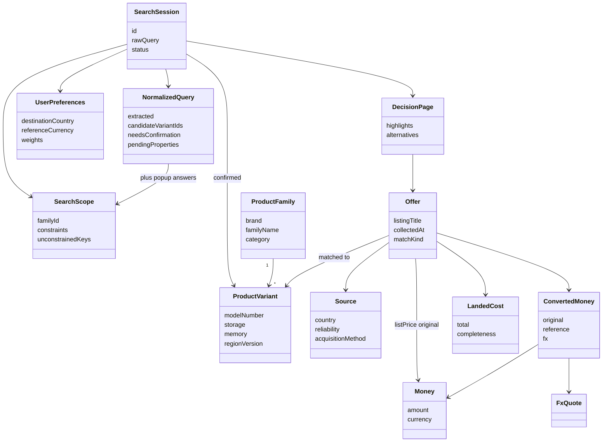

# Data model

The earlier entity list is a **domain model**: the things the system must understand (product, offer, money, session, decision). That is not automatically object-oriented.

**Object-oriented** is how we *implement* those things: classes with identity, value objects, and relationships. That fits this app well because a search is a pipeline of collaborating objects (`Offer` keeps original `Money`; conversion produces a separate `ConvertedMoney`; ranking attaches a `ScoreBreakdown` without mutating the source price).

We are **not** starting from a giant relational “price warehouse.” Persistence is thin (catalog + session). Most objects live for one search.

```
Conceptual domain  →  OO classes in the app  →  small stored records
     (entities)           (this document)         (catalog / session)
```

---

## Two kinds of objects

| Kind | Identity | Examples | Rule |
| --- | --- | --- | --- |
| **Entity** | Has an id; can change over time | `ProductVariant`, `Source`, `Offer`, `SearchSession` | Compare by id |
| **Value object** | No id; equal if fields are equal | `Money`, `FxQuote`, `NormalizedSpec`, `LandedCost` | Immutable; never overwrite in place |

This is the important OO choice for the assignment: **original price is a `Money` value object on the offer. FX does not replace it.**

---

## Object map



---

## Catalog entities (persisted, small)

These answer “what product could this be?” — not “what does it cost today?”

### `Category`

| Field | Type | Notes |
| --- | --- | --- |
| `id` | string | e.g. `smartphone`, `laptop`, `tablet` |
| `coreSpecKeys` | list of spec keys | Specs that matter for this category (storage, RAM, display, processor, battery, …) |
| `identityKeys` | list of spec keys | Fields that distinguish identical vs similar |
| `optionalKeys` | list of spec keys | Nice-to-have; the user may answer “not important” |

MVP categories: smartphones, laptops, tablets (assignment: 2–3 categories).

**The keys differ per category, and the pipeline reads them.** A phone is identified by storage + memory + region; a laptop adds the `processor`, because an M4 and an M4 Pro are different products at different prices; a tablet adds `connectivity`, because Wi-Fi and cellular builds are sold at different prices. `coreSpecKeys` are corroborating evidence during matching: they never create a match on their own, but a listing that states a conflicting display size or chip is not the confirmed product. Category also drives landed cost — duty rates, parcel-size shipping and destination registration levies are looked up per `(destination, category)`.

### `ProductFamily`

A model line, not a buyable SKU.

| Field | Type | Example |
| --- | --- | --- |
| `id` | string | `samsung-galaxy-s26-ultra` |
| `categoryId` | string | `smartphone` |
| `brand` | string | `Samsung` |
| `familyName` | string | `Galaxy S26 Ultra` |
| `aliases` | list of strings | `S26 Ultra`, `Galaxy S26U` — for normalization / typos |
| `validOptions` | map | `{ storageGb: [256, 512, 1024], memoryGb: [12, 16] }` |

`validOptions` is what the **confirmation gate** uses when input is invalid or ambiguous: “600 GB isn’t an option — 512 GB or 1 TB?” If the user’s specs already match a single catalog variant, skip confirmation.

### `ProductVariant`

The exact product the user confirms. Offers match **to** this, or are tagged similar/different.

| Field | Type | Example |
| --- | --- | --- |
| `id` | string | `samsung-galaxy-s26-ultra-512-12-eu` |
| `familyId` | string | |
| `modelName` | string | `Galaxy S26 Ultra` |
| `modelNumber` | string? | Official model code if known |
| `gtin` | string? | EAN/UPC/GTIN when we have it |
| `storageGb` | number? | `512` |
| `memoryGb` | number? | `12` |
| `regionVersion` | string? | `EU`, `US`, `TR`, `JP`, … |
| `colour` | string? | `Sky Blue` |
| `processor` | string? | `M4 Pro`, `Intel Core Ultra 9` — laptop/tablet identity |
| `connectivity` | string? | `Wi-Fi`, `Wi-Fi + Cellular` — tablet identity |
| `retailerSkus` | map source id → string | `{ "ebay": "v1\|123456789\|0" }` — this build's article number **at a specific source** |
| `canonicalSpecs` | list of `NormalizedSpec` | Battery, display size, … |

Specs read through `variant.attribute(key)`, which falls back to `canonicalSpecs` — so `display_inch` is usable in matching without being promoted to a field.

**`retailerSkus` is keyed by source for a reason.** A retailer SKU is only unique inside the retailer that issued it; the same string can name a phone at one site and a kettle at another. The matcher therefore looks up `retailerSkus[offer.sourceId]` and compares only against that, so a SKU can never match an offer from a different site. Populating it is optional and per-source: a build with no entry for the source simply falls through to attribute matching (see the two tiers in [architecture.md](architecture.md#7-product-matching)) rather than failing.

**Identity rule:** same family + same identity keys **for that category** (plus model number when present) ⇒ **identical**. Same family, different storage/region/chip/radio ⇒ **similar**: eligible as an alternative, never merged into the ranked list of the confirmed build.

**Family rule:** a query that matches no family does not start a search. The user is asked to refine it, and the only families offered as “did you mean” are ones that both score close enough *and* share a naming token with the query — so an iPad search is never answered with iPhones. If the family is certain but the exact build is not stocked, the popup offers the closest catalog variants instead of widening the search.

---

## Source entity (persisted)

### `Source`

| Field | Type | Notes |
| --- | --- | --- |
| `id` | string | `amazon-de`, `apple-us`, … |
| `displayName` | string | |
| `country` | ISO country | Offer country (assignment: TR, DE, US, UK, AE, FR, IT, JP — MVP 4–5) |
| `kind` | enum | `manufacturer` \| `authorized_retailer` \| `marketplace` \| `local_retailer` \| `other` |
| `reliability` | 0–1 | Official manufacturer > unknown marketplace seller |
| `acquisitionMethod` | enum | `api` \| `html` \| `headless` \| `fixture` |
| `baseUrl` | string? | |
| `notes` | string? | ToS / robots / rate-limit reminders |

Reliability lives here (and on marketplace `Seller`) so ranking can treat sources unequally.

---

## Value objects (immutable)

### `Money`

| Field | Type | Notes |
| --- | --- | --- |
| `amount` | decimal | Exact money, not float |
| `currency` | ISO 4217 | `EUR`, `USD`, `TRY`, … |

Never converted in place.

### `FxQuote`

| Field | Type | Notes |
| --- | --- | --- |
| `baseCurrency` | ISO 4217 | Offer currency |
| `quoteCurrency` | ISO 4217 | User reference currency |
| `rate` | decimal | |
| `asOf` | datetime (UTC)? | When the **provider published** this rate. **Must be shown.** `null` when no conversion happened |
| `provider` | string | Which FX API, or `identity` when base and quote are the same |

**`asOf` is a publication date, not a fetch time.** The ECB publishes one rate per business day, so Frankfurter returns a date and two searches minutes apart legitimately share the same `asOf`. That is the number the user needs — "which rate priced this offer" — and it must not be replaced with the moment we called the API, which would imply a precision the rate does not have. When the user wants to know how fresh the *listing* is, that is `Offer.collectedAt`, a different question with a different answer.

**Same currency means no conversion.** A TRY offer priced in TRY is not converted: the quote is `rate = 1`, `provider = identity`, `asOf = null`, and `isIdentity` is true. Explanations say "already in your reference currency" rather than quoting a rate, because showing "rate 1 as of today" would advertise a lookup that never happened.

### `ConvertedMoney`

| Field | Type | Notes |
| --- | --- | --- |
| `original` | `Money` | Source price, preserved |
| `reference` | `Money` | Equivalent in reference currency |
| `fx` | `FxQuote` | Rate + timestamp used |

Example (assignment §4): original €1,399 EUR; EUR/TRY = X at time T; TRY equivalent = Y. All three stay visible.

### `NormalizedSpec`

| Field | Type | Example |
| --- | --- | --- |
| `key` | string | `battery_mah` |
| `value` | number or string | `5000` |
| `unit` | string | `mAh` |
| `rawText` | string? | `"5,000 mAh"` / `"5 Ah"` as seen on the site |

Normalization maps messy source text into `key` + canonical `unit`. `rawText` is kept for trust and debugging — the Decision Page can show what the retailer actually wrote next to the value we compared on.

**Canonical unit per key** (`normalize/spec_parser.py`):

| Key | Canonical unit | Accepted source text |
| --- | --- | --- |
| `battery_mah` | mAh | `5,000 mAh`, `5.000 mAh`, `5000mAh`, `5 Ah`, `5.0 Ah` |
| `display_inch` | inches, 1 decimal | `6.9"`, `6,9 inç`, `6.9 inch`, `6.9 Zoll`, `6.9型`, `17,5 cm`, `175 mm` |
| `storage_gb` / `memory_gb` | GB | `512 GB`, `512GB`, `1 TB`, `1TB` |

Three parsing rules make this work across the locales in scope:

- **`,` is ambiguous and must be disambiguated.** A separator followed by exactly three digits is thousands grouping (`5,000` and German `5.000` are both 5000); otherwise it is a decimal point (`6,9` is 6.9). Getting this backwards turns a battery into a 5 mAh cell or a screen into a 69-inch television.
- **The unit word sets the scale, not the number's size.** `1 TB` is 1024 GB, not 1. `5 Ah` is 5000 mAh.
- **Metric and imperial must land on the same value.** Screen sizes are quoted to one decimal everywhere, so converted figures are rounded to one decimal: `17,5 cm` becomes `6.9`, not `6.89`. Without that rounding a centimetre-quoting source would "conflict" with a catalog value of `6.9` and block an otherwise correct match.

Text with no readable number yields **no spec at all** rather than a guess, so an unreadable field becomes missing data instead of a wrong comparison.

### `LandedCost`

Computed **after** FX, toward the user’s destination.

| Field | Type | Notes |
| --- | --- | --- |
| `listInReference` | `Money` | FX’d list price. Never modified — the sticker stays the sticker |
| `shipping` | `CostLine` | Estimated per **origin→destination lane**, scaled by category parcel size |
| `taxes` | `CostLine` | Destination import VAT, charged on the net price plus shipping plus duty |
| `importDuties` | `CostLine` | Border / import duty, per `(destination, category)` |
| `registrationFees` | `CostLine` | Category/region fees if relevant (e.g. TR handset IMEI registration) |
| `otherFees` | list of `CostLine` | Adjustments that are neither shipping nor a destination tax. Entries **may be negative** — origin-VAT removal lives here |
| `total` | `Money` | `listInReference` + every line above, including negative `otherFees` |
| `completeness` | enum | `complete` \| `partial` \| `unknown` — see below |
| `destinationCountry` | ISO country | |

`CostLine`: `{ amount: Money, origin: quoted | estimated | unavailable, label }`.

#### Origin VAT is removed before destination tax is added

A €1,349 German sticker **includes** 19% German VAT. An export sale does not charge it, so adding Turkish VAT on top of the gross figure taxes the buyer twice and overstates every import. The net price is therefore the base for duty and destination VAT:

```
net              = listInReference / (1 + originVatRate)
otherFees       += CostLine(net - listInReference, "DE VAT removed on export (19%)")   # negative
importDuties     = net × dutyRate(destination, category)
taxes            = (net + shipping + importDuties) × vatRate(destination)
total            = listInReference + otherFees + shipping + importDuties + taxes + registrationFees
```

The removal is recorded as a visible negative line rather than silently discounting the sticker, so the arithmetic on the Decision Page adds up to the total the user is shown.

#### What `completeness` means

| Value | When | Score multiplier |
| --- | --- | --- |
| `complete` | Domestic purchase on a published lane: no border to cross, and the only add-on is delivery | 1.00 |
| `partial` | Cross-border, but every rate and lane came from a published table. Still estimates, not seller quotes | 0.90 |
| `unknown` | At least one component **could not be looked up** — an unpublished shipping lane, an unknown destination VAT or duty rate — and a generic figure stood in for it | 0.75 |

The distinction that matters is **a figure we looked up versus a figure we invented**. A blind fallback is marked `unavailable` on its own `CostLine` and forces `completeness` to `unknown`, so it reaches the user as a caveat and the ranking as a penalty instead of disappearing into the total.

---

## Live entities (mostly per search)

### `Seller`

| Field | Type | Notes |
| --- | --- | --- |
| `name` | string | |
| `reliability` | 0–1? | Especially on marketplaces (e.g. feedback %) |
| `reviewCount` | int? | Feedback / review volume when the source exposes it |
| `isOfficial` | bool? | Manufacturer / authorized vs 3rd party |

### `Offer`

One listing, at collection time. This is the unit of comparison.

| Field | Type | Notes |
| --- | --- | --- |
| `id` | string | Per-search id |
| `sourceId` | string | |
| `seller` | `Seller` | |
| `country` | ISO country | Country of the offer |
| `listingTitle` | string | Raw title |
| `listingUrl` | string | |
| `imageUrl` | string? | |
| `listPrice` | `Money` | **Original; never overwritten** |
| `convertedListPrice` | `ConvertedMoney`? | Filled after FX |
| `landedCost` | `LandedCost`? | Filled after FX + fees |
| `stockStatus` | enum? | `in_stock` \| `limited` \| `out_of_stock` \| `unknown`. Out-of-stock offers are **excluded from ranking**; unknown carries lower confidence |
| `deliveryTime` | string? | Stored as the source phrased it (`"2-4 Werktage"`, `"1-3 iş günü"`). Ranking parses it to days at scoring time; unparseable text makes delivery a missing criterion rather than a guess |
| `warranty` | string? | Source phrasing (`"24 months"`, `"2 yıl"`). Parsed to months at scoring time; who issued the cover does not change the parsed length |
| `returnPolicy` | string? | |
| `retailerSku` | string? | Per-source SKU when available |
| `gtin` | string? | EAN/UPC when available |
| `modelNumber` | string? | Manufacturer model code when available |
| `rawSpecs` | list of `NormalizedSpec` | From this listing |
| `matchedVariantId` | string? | Set after matching |
| `matchKind` | enum | `identical` \| `similar` \| `different` \| `unmatched` |
| `matchNotes` | list of strings | e.g. “same family, storage 1TB vs 512GB” |
| `collectedAt` | datetime | Freshness; shown visibly on Decision Page cards. Cache TTL 15–30 min |
| `dataConfidence` | 0–1 | Weighted mix set by the adapter: `0.45 × source reliability + 0.30 × seller rating + 0.25 × review-volume score`, then `×0.85` if `stockStatus` is `unknown`. A weighted sum rather than a product, so one weak signal lowers confidence instead of collapsing it |

**Matching rule in the model:** two offers may share a `matchedVariantId` only when `matchKind = identical`. Similar SKUs (1 TB vs 512 GB, US vs EU version) stay separate offers and may become **alternatives**, not merged rows.

### `ScoreBreakdown`

Attached after ranking; does not replace commercial fields.

| Field | Type | Notes |
| --- | --- | --- |
| `criterionScores` | map | `price`, `seller`, `reviews`, `delivery`, `warranty` → 0–1. Only criteria this offer actually had; there is no `specs` key (identical offers share specs, so it would score 1.0 for everyone) |
| `weightsUsed` | map | The weights **as applied to this offer** — re-normalized to sum to 1 after dropping whatever was missing, so it may differ from the user's raw slider values |
| `missingCriteria` | list | What was unavailable — absent from the source, or present but unparseable |
| `confidencePenalty` | 0–1 | `1 − (dataConfidence × completenessMultiplier)` — display/metadata; ranking already applied the multiplier to `finalScore` |
| `reliabilityWarning` | string? | Set when effective confidence is below the highlight floor (0.7) |
| `finalScore` | 0–1 | |
| `explanation` | `Explanation` | Built before presentation |

Missing data: skip or down-weight that criterion; record it in `missingCriteria` so the explanation can say so.

---

## Session and decision (the user-facing aggregate)

### `UserPreferences`

| Field | Type | Notes |
| --- | --- | --- |
| `destinationCountry` | ISO country | Waterfall: default **TR**, then geolocation if permitted, then manual select (later overwrites earlier) |
| `referenceCurrency` | ISO 4217 | Same waterfall; default **TRY** |
| `origin` | enum | `default` \| `geolocation` \| `manual` — which step last set country/currency |
| `weights` | map of criterion → number | Set by sliders over `price`, `seller`, `reviews`, `delivery`, `warranty`. **Relative, not absolute** — the engine re-normalizes them, so only their proportions matter and they need not sum to 1. A weight of 0 removes the criterion. Defaults if sliders unchanged |

Example: `{ price: 0.40, seller: 0.20, reviews: 0.15, delivery: 0.10, warranty: 0.15 }`.

### `NormalizedQuery`

| Field | Type | Notes |
| --- | --- | --- |
| `rawText` | string | `"Aple 600GB telefon"` |
| `extracted` | map key → value | Whatever the parser could read off the text: `brand`, `storage_gb`, `colour`, … Keys that are not `ProductVariant` attributes are ignored when filtering the catalog |
| `candidateFamilyId` | string? | The single family the query resolved to. A query that resolves to none does not start a search |
| `candidateVariantIds` | list | Builds of that family still consistent with `extracted` |
| `needsConfirmation` | bool | `true` only if something is invalid, incomplete, or ambiguous — **false** when a unique catalog variant already matches |
| `pendingProperties` | list of `ConfirmationPrompt` | One entry per question the popup must ask. Empty when no popup is needed |

### `ConfirmationPrompt`

One question in the confirmation popup. It is structured rather than a prepared sentence, because the UI needs to render real controls (a set of radio buttons, an optional "doesn't matter" escape) and the API needs to validate the answer against the options that were actually offered.

| Field | Type | Notes |
| --- | --- | --- |
| `propertyKey` | string | What is being asked about: `storage_gb`, `colour`, `family_id`, or `variant_id` for a "closest build" question |
| `role` | enum | `identity` \| `optional`. Identity questions must be answered; optional ones may be skipped |
| `reason` | enum | `missing` \| `invalid` \| `ambiguous` \| `shorthand` \| `no_match` \| `no_exact_variant` — why we are asking, so the copy can differ between "600 GB isn't a thing" and "you didn't say" |
| `options` | list | The permitted answers. An answer outside this list is rejected |
| `allowNotImportant` | bool | Whether "doesn't matter" is offered. Only ever true for `optional` roles |

### `PropertyChoice`

One answer coming back from the popup.

| Field | Type | Notes |
| --- | --- | --- |
| `propertyKey` | string | Which prompt this answers |
| `kind` | enum | `value` (the user picked something) \| `not_important` (the user declined to constrain it) |
| `value` | any? | Set when `kind = value` |

`not_important` is not the same as an unanswered prompt. It is a deliberate instruction to widen the search on that property, and it is recorded separately (see `SearchScope.unconstrainedKeys`) so the Decision Page can say "you said colour doesn't matter" instead of quietly ignoring it.

### `SearchScope`

What the confirmation step produced: the definition of what this search is looking for. Every adapter fetch and every match is bounded by it.

| Field | Type | Notes |
| --- | --- | --- |
| `familyId` | string | Offers are never taken from another family |
| `constraints` | map key → value | The properties that are pinned, merged from `extracted` and the popup answers |
| `unconstrainedKeys` | list | Properties the user explicitly released with `not_important` |
| `variantIds` | list | Catalog builds still satisfying `constraints`. A scope that collapses to exactly one is the confirmed variant |

`SearchScope` is what makes the difference between "search for this exact build" and "search this family, any colour" expressible in one object. `constraints` and `unconstrainedKeys` are both needed: a key absent from both was never asked about, whereas a key in `unconstrainedKeys` was asked about and deliberately opened up.

### `SearchSession`

Orchestrator aggregate: one user search.

| Field | Type | Notes |
| --- | --- | --- |
| `id` | string | |
| `rawQuery` | string | |
| `normalizedQuery` | `NormalizedQuery` | |
| `propertyChoices` | list of `PropertyChoice` | The popup answers, kept as given. Retained rather than discarded after use so a re-confirm can be applied on top of earlier answers, and so the page can show what the user actually asked for |
| `searchScope` | `SearchScope`? | Derived from `normalizedQuery` + `propertyChoices`. Once set it is reused rather than recomputed, so a later step cannot silently resolve the scope differently from the fetch that already happened |
| `confirmedVariantId` | string? | Set immediately on a unique valid catalog hit, or after the user confirms |
| `preferences` | `UserPreferences` | Captured as an explicit user step at session start (defaults if unchanged) |
| `status` | enum | `received` \| `needs_confirmation` \| `fetching` \| `ranked` \| `failed` |
| `failureReason` | string? | Set when `status` is `failed` — why no Decision Page could be built (e.g. all FX conversions failed) |
| `createdAt` | datetime | |

Live fetch starts when there is a confirmed variant. Unique catalog matches skip `needs_confirmation`.

### `Explanation`

| Field | Type | Notes |
| --- | --- | --- |
| `headline` | string | One-sentence why |
| `reasons` | list of `{ factor, detail }` | The criteria that actually won the comparison, largest margin first |
| `caveats` | list of strings | Partial fees, missing stock, … |

`reasons` is not a dump of every criterion the offer scored well on. A criterion earns a place only if the offer's **weighted** contribution on it (slider weight × 0–1 score) beats the offer it had to outrank — second place for the winner, the offer directly above for anyone else. `detail` states the value in the offer's own units ("Warranty: 24 months", "12,000 seller reviews to judge from"), never a 0–1 score, because a reader cannot act on a normalized number.

### `DecisionHighlight`

Assignment Decision Page “best of” lenses:

| `kind` | Meaning |
| --- | --- |
| `lowest_list_price` | Cheapest **original** list, after FX only (sticker) |
| `lowest_total_cost` | Cheapest **landed** cost |
| `best_warranty` | Longest / strongest parsed warranty among eligible offers |
| `best_seller` | Highest seller criterion — the seller's own rating blended with the hosting site's reputation |
| `best_overall` | Highest `finalScore` for this user’s weights (“best for you”). If this offer also wins another lens, the other highlight is dropped. |

Each highlight: `{ kind, offerId, explanation }`.

### `Alternative`

| Field | Type | Notes |
| --- | --- | --- |
| `offerId` | string | |
| `kind` | enum | `spec_variant` (same family, different specs) \| `comparable_product` |
| `badge` | enum? | `upgrade` \| `downgrade` \| `rival`, or absent. See below |
| `differingAttributes` | list | e.g. storage 512 → 1024 |
| `landedCostDelta` | `Money`? | **This offer's landed cost minus the top pick's.** Negative means cheaper |
| `explanation` | `Explanation` | What differs, the cost delta, and the value test passed (or a caveat that none was) |

`kind` says what sort of thing the alternative is; `badge` says whether the system is prepared to make a claim about its value. They are separate because an alternative can be a legitimate option to show without clearing a value test — see [proposed-algorithm.md](proposed-algorithm.md) step 6 for the thresholds.

`landedCostDelta` is a **delta, not a total**. The alternatives panel answers "what would switching cost me?", so the difference is the number the reader wants; the alternative's own total is still reachable through its `Offer`. A `Money` of `-2100 TRY` therefore means "2,100 TRY cheaper than the offer we recommended", not "costs -2,100 TRY".

### `DecisionPage`

What the UI renders.

| Field | Type | Notes |
| --- | --- | --- |
| `sessionId` | string | |
| `confirmedVariant` | `ProductVariant` | Reference product |
| `offers` | list of `Offer` | Matched + ranked by `finalScore` (full list) |
| `offerScores` | map `offerId` → `ScoreBreakdown` | Parallel scores / warnings for the full list UI |
| `highlights` | list of `DecisionHighlight` | Only offers with effective confidence ≥ 0.7 |
| `alternatives` | list of `Alternative` | Ranked by `finalScore` alongside the main list; cap 3. Empty only when there were no near-offers |
| `generatedAt` | datetime | |

---

## What is stored vs in-memory

Only the **reference catalog** is persisted: `Category`, `ProductFamily`, `ProductVariant`, and `Source`, as seed JSON under `data/`. Everything a search produces — `Offer`, `ScoreBreakdown`, `Explanation`, `DecisionPage` — exists for the duration of the request and is then discarded. Prices are not a historical warehouse.

### `SearchSession` is not stored either: the API is stateless by design

There is no server-side session table and no session id to look up. `SearchSession` is a **request/response payload**: `POST /search/start` returns one, the client sends it back to `POST /search/confirm` with the popup answers, gets an updated one, and sends that to `POST /search/run`. The server holds nothing between calls.

This is deliberate, for three reasons:

- **A price is a fact about a moment.** A stored session invites replaying a stale Decision Page as if it were current. Making the client carry the state means every Decision Page is built from a fetch that just happened.
- **Nothing to expire or invalidate.** No session store means no TTL policy, no eviction, no cleanup job, and no class of bug where two requests disagree about what the user confirmed.
- **It scales sideways for free.** Any instance can serve any request, which matters for a prototype that may be demoed from anywhere.

The trade-off is real and accepted: the payload travelling both ways is larger than a session id would be, and a client that loses the object loses the search.

`SearchSession` still *has* fields that look like stored state — `propertyChoices`, `searchScope`, `confirmedVariantId` — because the state has to live somewhere across the confirm/run boundary. The distinction is that it lives in the payload, not on the server.

### The one cache: remembered offers, for re-ranking

`SearchMemory` holds the offers from a completed fetch, keyed by session id, for `OFFER_CACHE_TTL_SECONDS` (default 15 minutes). It exists so that changing a weight slider does not re-hit every retailer: re-ranking is pure arithmetic over offers already in hand, so `POST /search/rerank` reuses them and re-runs only scoring, explanations, highlights and alternatives.

Avoiding the re-fetch is not only about speed. Prices move. If a slider change triggered a second fetch, the user would be comparing a different set of offers while believing they had changed one input, and any difference in the result would be unattributable.

This does not weaken the stateless contract above, and the distinction is worth being precise about:

- It is a cache **in front of the adapters**, not a session store. It holds fetched offers, not the user's confirmation state, which still travels in the payload.
- **Nothing requires it.** `POST /search/run` never reads it, so a cold instance answers a search identically to a warm one.
- **A miss is an ordinary outcome, not an error state.** It costs a re-fetch. `POST /search/rerank` answers `409` and the client calls `/search/run` again.
- It is **bounded** (`MAX_REMEMBERED_SEARCHES`) and expires on a monotonic clock, so a clock adjustment cannot make a stale fetch look current.

Setting the TTL to `0` disables it entirely, which is the switch for running with no server-side memory at all.

Two things are deliberately **not** re-rankable: destination country and reference currency. Landed cost and FX were computed against the originals, so re-scoring on a changed destination would rank totals that answer a different question. Those changes are refused and the client is told to search again.

One more cache could be justified later and is not built: recent `FxQuote` values, since the ECB publishes daily and re-fetching per request is wasteful. `FxService` already keeps an in-process rate cache for an hour, which covers the prototype.

---

## Why this shape (for the assignment)

- **Currency:** `listPrice` stays original `Money`; `ConvertedMoney` + `FxQuote.asOf` are extra fields.
- **Same vs similar vs different:** `ProductVariant` identity keys + `Offer.matchKind`.
- **Spec normalization:** `NormalizedSpec` with `rawText` + canonical unit.
- **Global offers:** `Source.country` + `Offer.country` + destination on `LandedCost`.
- **Decision Page:** `DecisionPage` + highlights + explanations, not a single “cheapest” string.
- **Missing/unreliable data:** `completeness`, `dataConfidence`, `missingCriteria` — first-class, not afterthoughts.

These classes are implemented in `src/gp_price_intel/domain/models.py` as **Pydantic v2 models** on Python 3.11+. Pydantic rather than plain dataclasses because the same definitions have to do three jobs: validate untrusted input at the API boundary, serialize to JSON for the Decision Page, and enforce immutability on the value objects (`Money`, `FxQuote`, `ConvertedMoney`, `NormalizedSpec`, `CostLine` and `LandedCost` are frozen, which is what makes "the original price is never overwritten" a guarantee rather than a convention). Writing that by hand around dataclasses would be the same code with more room for it to drift.

This document writes field names in `camelCase` for readability. The Python fields and the JSON on the wire are both `snake_case` — there is no alias layer, so `listPrice` here is `list_price` in both.
