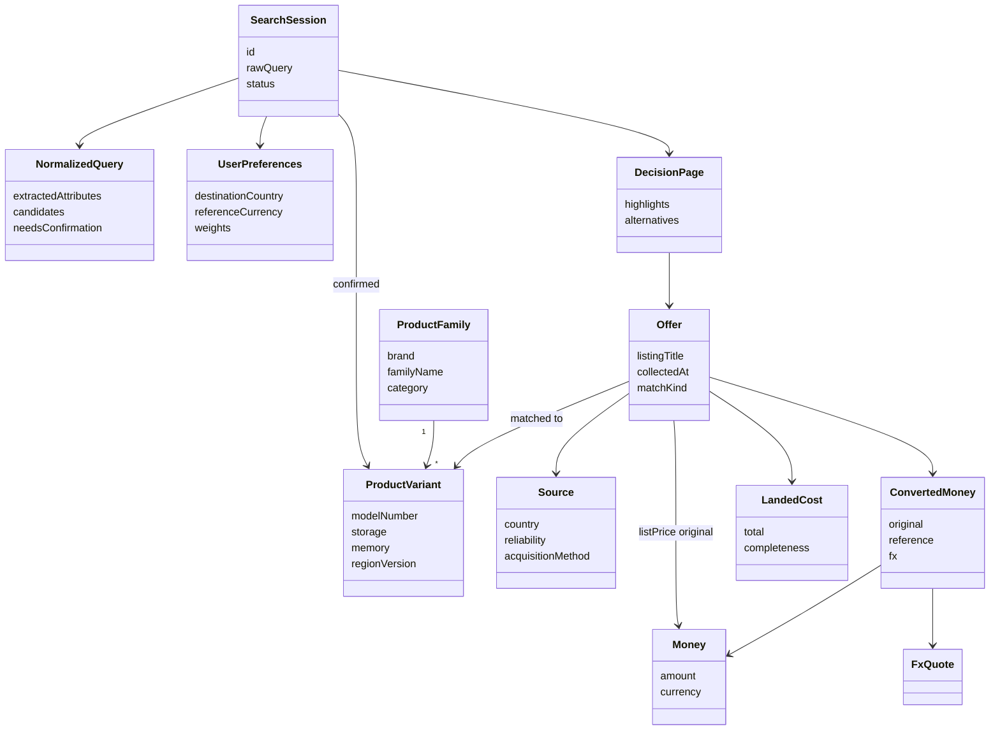

# Data model

The earlier entity list is a **domain model**: the things the system must understand (product, offer, money, session, decision). That is not automatically object-oriented.

**Object-oriented** is how we *implement* those things: classes with identity, value objects, and relationships. That fits this app well because a search is a pipeline of collaborating objects (`Offer` keeps original `Money`; conversion produces a separate `ConvertedMoney`; ranking attaches a `ScoreBreakdown` without mutating the source price).

We are **not** starting from a giant relational “price warehouse.” Persistence is thin (catalog + session). Most objects live for one search.

```
Conceptual domain  →  OO classes in the app  →  small stored records
     (entities)           (this document)         (catalog / session)
```

---

## Two kinds of objects

| Kind | Identity | Examples | Rule |
| --- | --- | --- | --- |
| **Entity** | Has an id; can change over time | `ProductVariant`, `Source`, `Offer`, `SearchSession` | Compare by id |
| **Value object** | No id; equal if fields are equal | `Money`, `FxQuote`, `NormalizedSpec`, `LandedCost` | Immutable; never overwrite in place |

This is the important OO choice for the assignment: **original price is a `Money` value object on the offer. FX does not replace it.**

---

## Object map



---

## Catalog entities (persisted, small)

These answer “what product could this be?” — not “what does it cost today?”

### `Category`

| Field | Type | Notes |
| --- | --- | --- |
| `id` | string | e.g. `smartphone`, `laptop`, `tablet` |
| `coreSpecKeys` | list of spec keys | Specs that matter for this category (storage, RAM, display, battery, …) |
| `identityKeys` | list of spec keys | Must be resolved before search; distinguish identical vs similar (storage, memory, region). **No “Not important.”** |
| `optionalKeys` | list of spec keys | Catalogued but **not** used for scoring (e.g. colour, finish). Missing → popup with options **+ “Not important.”** |

MVP categories: smartphones, laptops, tablets (assignment: 2–3 categories).

### `ProductFamily`

A model line, not a buyable SKU.

| Field | Type | Example |
| --- | --- | --- |
| `id` | string | `samsung-galaxy-s26-ultra` |
| `categoryId` | string | `smartphone` |
| `brand` | string | `Samsung` |
| `familyName` | string | `Galaxy S26 Ultra` |
| `aliases` | list of strings | `S26 Ultra`, `Galaxy S26U` — for normalization / typos |
| `validOptions` | map | `{ storageGb: [256, 512, 1024], memoryGb: [12, 16], colour: ["Black", "Silver"] }` |

`validOptions` feeds the **confirmation popup**:

- Missing **identity** key (e.g. user typed `Samsung S26` with no storage) → list those options; user **must** pick one.
- Missing **optional** key (e.g. colour) → list those options **plus `not_important`**.
- Invalid value (e.g. `600 GB`) → nearest/valid options only; still no `not_important` for identity keys.
- Fully specified unique variant → skip confirmation.

### `ProductVariant`

The exact product the user confirms. Offers match **to** this, or are tagged similar/different.

| Field | Type | Example |
| --- | --- | --- |
| `id` | string | `samsung-galaxy-s26-ultra-512-12-eu` |
| `familyId` | string | |
| `modelName` | string | `Galaxy S26 Ultra` |
| `modelNumber` | string? | Official model code if known |
| `gtin` | string? | EAN/UPC/GTIN when we have it |
| `storageGb` | number? | `512` |
| `memoryGb` | number? | `12` |
| `regionVersion` | string? | `EU`, `US`, `TR`, `JP`, … |
| `canonicalSpecs` | list of `NormalizedSpec` | Battery, display, processor, … |

**Identity rule:** same family + same identity keys (storage, memory, region/version, model number when present) ⇒ **identical**. Same family, different storage/region ⇒ **similar**, not mergeable as one offer group.

---

## Source entity (persisted)

### `Source`

| Field | Type | Notes |
| --- | --- | --- |
| `id` | string | `amazon-de`, `apple-us`, … |
| `displayName` | string | |
| `country` | ISO country | Offer country (assignment: TR, DE, US, UK, AE, FR, IT, JP — MVP 4–5) |
| `kind` | enum | `manufacturer` \| `authorized_retailer` \| `marketplace` \| `local_retailer` \| `other` |
| `reliability` | 0–1 | Official manufacturer > unknown marketplace seller |
| `acquisitionMethod` | enum | `api` \| `html` \| `headless` |
| `baseUrl` | string? | |
| `notes` | string? | ToS / robots / rate-limit reminders |

Reliability lives here (and on marketplace `Seller`) so ranking can treat sources unequally.

---

## Value objects (immutable)

### `Money`

| Field | Type | Notes |
| --- | --- | --- |
| `amount` | decimal | Exact money, not float |
| `currency` | ISO 4217 | `EUR`, `USD`, `TRY`, … |

Never converted in place.

### `FxQuote`

| Field | Type | Notes |
| --- | --- | --- |
| `baseCurrency` | ISO 4217 | Offer currency |
| `quoteCurrency` | ISO 4217 | User reference currency |
| `rate` | decimal | |
| `asOf` | datetime (UTC) | **Must be shown** on the Decision Page |
| `provider` | string | Which FX API |

### `ConvertedMoney`

| Field | Type | Notes |
| --- | --- | --- |
| `original` | `Money` | Source price, preserved |
| `reference` | `Money` | Equivalent in reference currency |
| `fx` | `FxQuote` | Rate + timestamp used |

Example (assignment §4): original €1,399 EUR; EUR/TRY = X at time T; TRY equivalent = Y. All three stay visible.

### `NormalizedSpec`

| Field | Type | Example |
| --- | --- | --- |
| `key` | string | `battery_mah` |
| `value` | number or string | `5000` |
| `unit` | string | `mAh` |
| `rawText` | string? | `"5,000 mAh"` / `"5 Ah"` as seen on the site |

Normalization maps messy source text into `key` + canonical `unit`. `rawText` is kept for trust and debugging.

### `LandedCost`

Computed **after** FX, toward the user’s destination.

| Field | Type | Notes |
| --- | --- | --- |
| `listInReference` | `Money` | FX’d list price |
| `shipping` | `CostLine` | |
| `taxes` | `CostLine` | VAT / sales tax if applicable |
| `importDuties` | `CostLine` | Border / import |
| `registrationFees` | `CostLine` | Category/region fees if relevant |
| `otherFees` | list of `CostLine` | |
| `total` | `Money` | Sum in reference currency |
| `completeness` | enum | `complete` \| `partial` \| `unknown` |
| `destinationCountry` | ISO country | |

`CostLine`: `{ amount: Money, origin: quoted | estimated | unavailable, label }`.

If a line is `unavailable`, `completeness` is not `complete`. Ranking must not pretend precision.

---

## Live entities (mostly per search)

### `Seller`

| Field | Type | Notes |
| --- | --- | --- |
| `name` | string | |
| `reliability` | 0–1? | Especially on marketplaces |
| `isOfficial` | bool? | Manufacturer / authorized vs 3rd party |

### `Offer`

One listing, at collection time. This is the unit of comparison.

| Field | Type | Notes |
| --- | --- | --- |
| `id` | string | Per-search id |
| `sourceId` | string | |
| `seller` | `Seller` | |
| `country` | ISO country | Country of the offer |
| `listingTitle` | string | Raw title |
| `listingUrl` | string | |
| `imageUrl` | string? | |
| `listPrice` | `Money` | **Original; never overwritten** |
| `convertedListPrice` | `ConvertedMoney`? | Filled after FX |
| `landedCost` | `LandedCost`? | Filled after FX + fees |
| `stockStatus` | enum? | `in_stock` \| `limited` \| `out_of_stock` \| `unknown`. Out-of-stock offers are **excluded from ranking**; unknown carries lower confidence |
| `deliveryTime` | string? | Keep source phrasing + optional normalized days |
| `warranty` | string? | |
| `returnPolicy` | string? | |
| `rawSpecs` | list of `NormalizedSpec` | From this listing |
| `matchedVariantId` | string? | Set after matching |
| `matchKind` | enum | `identical` \| `similar` \| `different` \| `unmatched` |
| `matchNotes` | list of strings | e.g. “same family, storage 1TB vs 512GB” |
| `collectedAt` | datetime | Freshness; shown visibly on Decision Page cards. Cache TTL 15–30 min |
| `dataConfidence` | 0–1 | Missing/conflicting fields pull this down |

**Matching rule in the model:** two offers may share a `matchedVariantId` only when `matchKind = identical`. Similar SKUs (1 TB vs 512 GB, US vs EU version) stay separate offers and may become **alternatives**, not merged rows.

### `ScoreBreakdown`

Attached after ranking; does not replace commercial fields.

| Field | Type | Notes |
| --- | --- | --- |
| `criterionScores` | map | `price`, `seller`, `warranty`, `specs`, `delivery`, … → 0–1 |
| `weightsUsed` | map | Copy of user weights |
| `missingCriteria` | list | What was unavailable |
| `confidencePenalty` | 0–1 | Unreliable / partial landed cost |
| `finalScore` | 0–1 | |
| `explanation` | `Explanation` | Built before presentation |

Missing data: skip or down-weight that criterion; record it in `missingCriteria` so the explanation can say so.

---

## Session and decision (the user-facing aggregate)

### `UserPreferences`

| Field | Type | Notes |
| --- | --- | --- |
| `destinationCountry` | ISO country | Waterfall: default **TR**, then geolocation if permitted, then manual select (later overwrites earlier) |
| `referenceCurrency` | ISO 4217 | Same waterfall; default **TRY** |
| `origin` | enum | `default` \| `geolocation` \| `manual` — which step last set country/currency |
| `weights` | map of criterion → 0–1 | Set by sliders; must sum to 1. Defaults if sliders unchanged |

Example: `{ price: 0.50, seller: 0.25, warranty: 0.15, specs: 0.10 }`.

### `NormalizedQuery`

| Field | Type | Notes |
| --- | --- | --- |
| `rawText` | string | `"Samsung S26"` or `"Aple 600GB telefon"` |
| `extracted` | identity-like fields | Brand, family, storage, colour, … as parsed (may be incomplete) |
| `candidateFamilyId` | string? | Catalog family hit |
| `candidateVariantIds` | list | Catalog hits (may be many if colour unconstrained) |
| `needsConfirmation` | bool | `true` if any identity key missing/invalid/ambiguous, or optional keys need a prompt — **false** when fully specified |
| `pendingProperties` | list of `ConfirmationPrompt` | One entry per property the popup must ask |

### `ConfirmationPrompt`

| Field | Type | Notes |
| --- | --- | --- |
| `propertyKey` | string | e.g. `storageGb`, `colour` |
| `role` | enum | `identity` \| `optional` |
| `reason` | enum | `missing` \| `invalid` \| `ambiguous` |
| `options` | list | Available catalog values |
| `allowNotImportant` | bool | `true` only when `role = optional` |

### `PropertyChoice`

User’s answer for one prompted property.

| Field | Type | Notes |
| --- | --- | --- |
| `propertyKey` | string | |
| `kind` | enum | `value` \| `not_important` |
| `value` | any? | Set when `kind = value`; unset when `not_important` |

`not_important` is **only valid** for `optional` properties. Identity properties must use `kind = value`.

### `SearchScope`

What live search and ranking are allowed to cover after confirmation.

| Field | Type | Notes |
| --- | --- | --- |
| `familyId` | string | Confirmed model family |
| `constraints` | map of property → value | Identity (and any optional) properties the user fixed |
| `unconstrainedKeys` | list of strings | Optional keys marked **Not important** — include **all** `validOptions` for these |
| `variantIds` | list of strings | All catalog variants matching constraints (one if fully pinned; many if colour is unconstrained) |

Matching: offers that match any variant in `variantIds` on identity keys count as in-scope. Different unconstrained colours of the same storage are comparable as the same decision target, not as “similar alternatives,” unless the user later cares about colour.

### `SearchSession`

Orchestrator aggregate: one user search.

| Field | Type | Notes |
| --- | --- | --- |
| `id` | string | |
| `rawQuery` | string | |
| `normalizedQuery` | `NormalizedQuery` | |
| `propertyChoices` | list of `PropertyChoice` | Answers from the confirm popup |
| `searchScope` | `SearchScope`? | Set after auto-match or popup; drives live fetch |
| `confirmedVariantId` | string? | Set when scope collapses to exactly one variant; otherwise null and use `searchScope.variantIds` |
| `preferences` | `UserPreferences` | Captured as an explicit user step at session start (defaults if unchanged) |
| `status` | enum | `received` \| `needs_confirmation` \| `fetching` \| `ranked` \| `failed` |
| `createdAt` | datetime | |

Live fetch starts when `searchScope` is set and every identity key is constrained. Unique fully specified catalog matches skip `needs_confirmation`.

### `Explanation`

| Field | Type | Notes |
| --- | --- | --- |
| `headline` | string | One-sentence why |
| `reasons` | list of `{ factor, detail }` | Landed cost, warranty, seller, … |
| `caveats` | list of strings | Partial fees, missing stock, … |

### `DecisionHighlight`

Assignment Decision Page “best of” lenses:

| `kind` | Meaning |
| --- | --- |
| `lowest_list_price` | Cheapest **original** list, after FX only (sticker) |
| `lowest_total_cost` | Cheapest **landed** cost |
| `best_specification` | Strongest specs vs confirmed variant |
| `best_warranty` | |
| `best_seller` | Reliability / official status |
| `best_overall` | Highest `finalScore` for this user’s weights |

Each highlight: `{ kind, offerId, explanation }`.

### `Alternative`

| Field | Type | Notes |
| --- | --- | --- |
| `offerId` | string | |
| `kind` | enum | `spec_variant` (same family, different specs) \| `comparable_product` |
| `differingAttributes` | list | e.g. storage 512 → 1024 |
| `landedCostDelta` | `Money`? | vs best-overall / confirmed |
| `explanation` | `Explanation` | Must pass value-test guardrails |

### `DecisionPage`

What the UI renders.

| Field | Type | Notes |
| --- | --- | --- |
| `sessionId` | string | |
| `confirmedVariant` | `ProductVariant`? | Set when scope is a single variant; else primary/reference from identity constraints |
| `offers` | list of `Offer` | Matched + scored |
| `highlights` | list of `DecisionHighlight` | |
| `alternatives` | list of `Alternative` | Cap ~3; omit if none pass |
| `generatedAt` | datetime | |

---

## What is stored vs in-memory

| Persist | Per-search (memory, optional short cache) |
| --- | --- |
| `Category`, `ProductFamily`, `ProductVariant` | `Offer` and nested money/cost/specs |
| `Source` | `ScoreBreakdown`, `Explanation` |
| `SearchSession` (query, confirmation, preferences) | `DecisionPage` (may snapshot later for demos) |
| Optional: recent `FxQuote` | |

Prices are not a historical warehouse in v1.

---

## Why this shape (for the assignment)

- **Currency:** `listPrice` stays original `Money`; `ConvertedMoney` + `FxQuote.asOf` are extra fields.
- **Same vs similar vs different:** `ProductVariant` identity keys + `Offer.matchKind`.
- **Spec normalization:** `NormalizedSpec` with `rawText` + canonical unit.
- **Global offers:** `Source.country` + `Offer.country` + destination on `LandedCost`.
- **Decision Page:** `DecisionPage` + highlights + explanations, not a single “cheapest” string.
- **Missing/unreliable data:** `completeness`, `dataConfidence`, `missingCriteria` — first-class, not afterthoughts.

Implementation later can be Python dataclasses, TypeScript types, or another OO language. The classes above are the contract; the language is still open.
